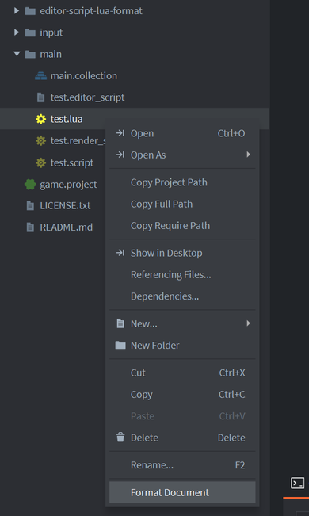

# Lua Code Formatter for Defold IDE

[](https://travis-ci.com/indiesoftby/defold-editor-script-lua-format) [](https://ci.appveyor.com/project/aglitchman/defold-editor-script-lua-format/branch/build-lua-format)

[Defold IDE](https://www.defold.com) editor script that reformats your Lua source code. Uses [LuaFormatter](https://github.com/Koihik/LuaFormatter).

## Installation

~~You can use this editor script in your own project by adding it as a [Defold library dependency](http://www.defold.com/manuals/libraries/). Open your `game.project` file and in the dependencies field under project add:~~

~~[https://github.com/indiesoftby/defold-editor-script-lua-format/archive/master.zip](https://github.com/indiesoftby/defold-editor-script-lua-format/archive/master.zip)~~

**The script will work if you simply copy paste the script folder into your project.**

This script is accessible through the context menu in the asset view, it's context sensitive and will only show when you are clicking on the relevant file - `.lua`, `.script`, `.render_script` or `.editor_script`.



## Git pre-commit hook

Git has a way of firing off custom scripts that perform certain operations. These scripts are referred to as *hooks*. The hooks are all stored in the `hooks` subdirectory of the Git directory that's `.git/hooks`.

*Note:* `.git/hooks` directory isn't cloned with the rest of your project, nor is it under version control.

`editor-script-lua-format/git-hooks/pre-commit` contains a sample hook that applies a coding style with `lua-format` to staged files. It will help you format your code before you commit them. So when you try to commit your code, given script will run and format staged files.

Copy contents of the sample pre-commit hook to the custom pre-commit:

```bash
$ cp ./editor-script-lua-format/git-hooks/pre-commit ./git/hooks/pre-commit
```

Make the pre-commit script executable (only on Linux and macOS):

```bash
$ chmod +x ./git/hooks/pre-commit
```

## Style configuration

Lua formatter will attempt to automatically use the root directory's `.lua-format` file. In case there's no file, it will fallback to the default configuration.

See [this file](https://github.com/Koihik/LuaFormatter/blob/master/docs/Style-Config.md)

## Default configuration

```
column_limit: 80
indent_width: 4
use_tab: false
tab_width: 4
continuation_indent_width: 4
spaces_before_call: 1
keep_simple_control_block_one_line: true
keep_simple_function_one_line: true
align_args: true
break_after_functioncall_lp: false
break_before_functioncall_rp: false
align_parameter: true
chop_down_parameter: false
break_after_functiondef_lp: false
break_before_functiondef_rp: false
align_table_field: true
break_after_table_lb: true
break_before_table_rb: true
chop_down_table: false
chop_down_kv_table: true
table_sep: ","
extra_sep_at_table_end: false
break_after_operator: true
double_quote_to_single_quote: false
single_quote_to_double_quote: false
```

## Limitations

- Does not work when source file contains syntax error

## License

Apache 2 License.
